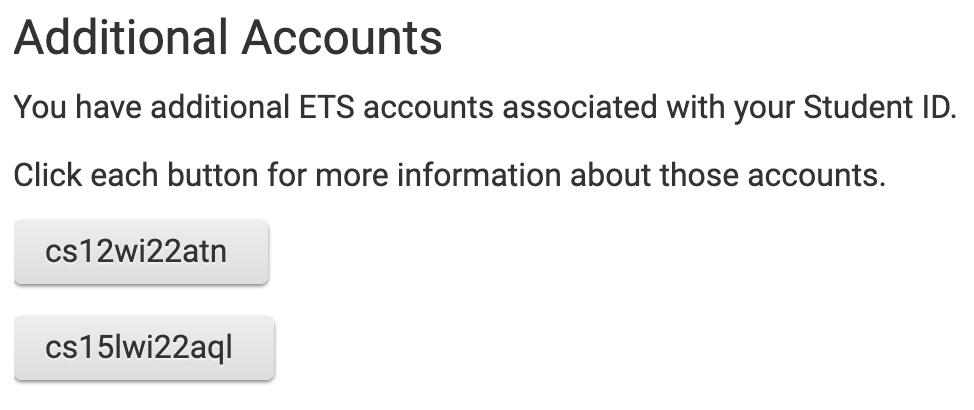
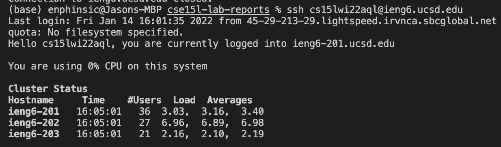
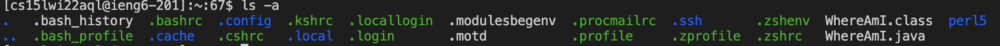
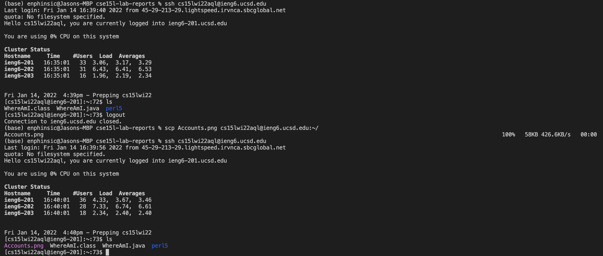
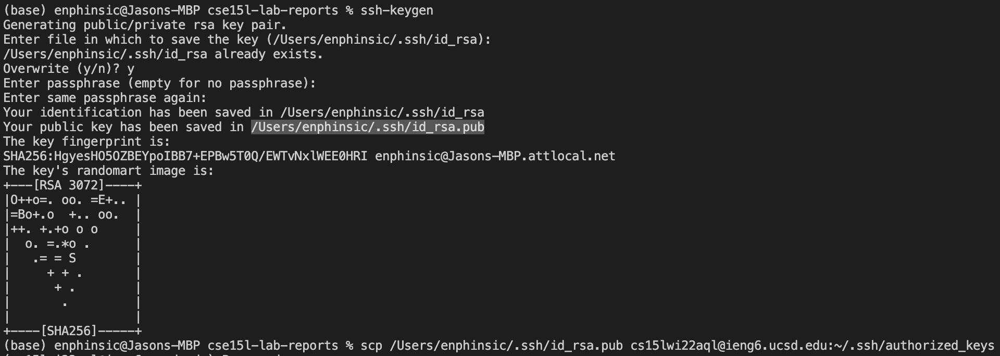

> # **Installing VSCode**
---
1. Navigate to Visual Studio Code's website: [https://code.visualstudio.com/](https://code.visualstudio.com/)
2. Download and launch VSCode, following all appropirate prompts and setting up all desired settings/preferences
3. When opened, **hit &nbsp;``Ctrl + ` ``**, this will **open** up the **Terminal** (which is where we will be running the commands to remotely connect)

---

> # **Remotely Connecting**
---
1. ### **Account Setup:**
    - ***Note:*** If you already know your account credentials skip to **2. Remote Connection**
    - **Navigate to [https://sdacs.ucsd.edu/~icc/index.php**](https://sdacs.ucsd.edu/~icc/index.php**), and under "Account Lookup" enter your Username and Student ID
    - Under **"Additional Accounts"**, click on the account's name button relevant to the course you are taking
        - **Ex:** *"cs15lwi22aql"*
    
        - "cse15l" being the course name
        - "wi" being the quarter you are taking the class
        - "22" being the year you are taking the class
        - "aql" being 3 unique characters for your account**
    - Click on "change your password" and do so

2. ### **Remove Connection:**
    - ***Note:*** If on **Windows**, navigate to: [https://docs.microsoft.com/en-us/windows-server/administration/openssh/openssh_install_firstuse](https://docs.microsoft.com/en-us/windows-server/administration/openssh/openssh_install_firstuse) to **install OpenSSH**
    - In the **terminal**, **type &nbsp; `ssh [username]@ieng6.ucsd.edu`**
    - Enter your password
        - ***Note:*** Even if you entered the **correct password**, you may **not be able to log in**. In this case **keep trying** and if the password prompt disappears, enter the above command again
    - Results should look like this: 
    - You are now connected!
    - To disconnect, **hit &nbsp; `Ctrl + D` &nbsp; or &nbsp;type &nbsp; `exit`**

---

> # **Trying Some Commands**
---
1. Now that you are connected, you can run commands on the server
2. Some include:
    - `pwd` (**P**rint **W**orking **D**irectory) to **print the directory** you are currently in
    - `ls` (**L**i**s**t) to **list the files, directories, and folders** in the current directory
    - `cd [directory/folder name]` (**C**hange **D**irectory) to **change** the **directory** you are currently working in
    - `cat [file name`] (Con**cat**enate) to **create a text file** and/or to **view the contents** of one
    - ***Note:*** you can type `man` (**Man**ual) in front of a command to **read more** about it and to see **more options** relevant to the command
 

---

> # **Moving Files with `scp`**
---
1. Be sure to disconnect before proceeding to avoid possible issues
2. Type `scp [filename] [username]@ieng6.ucsd.edu:~/` and login when prompted
3. ***Note:*** After the `scp` command is run, it logs you out
4. ***Optional:*** Type `ls` to see the file you copied over

---

> # **Setting an SSH Key**
---
1. You may have noticed that I am able to connect to the server **without password prompts**, well, that's because of **SSH Keys**
2. On **your computer**, **type `ssh-keygen`**
3. When prompted to choose the destination file, simply hit `Enter`
4. Also hit `Enter` when prompted to enter a passphrase (to login without a password)
    - ***Note:*** If on **Windows**, follow [https://docs.microsoft.com/en-us/windows-server/administration/openssh/openssh_keymanagement#user-key-generation](https://docs.microsoft.com/en-us/windows-server/administration/openssh/openssh_keymanagement#user-key-generation) in addition
5. Copy the ***Public Key*** over to the `.ssh/authorized_keys` directory on the server
    - ***Public Key*** name is highlighted in picture below:  

> # **Optimizing Remote Running**
---
