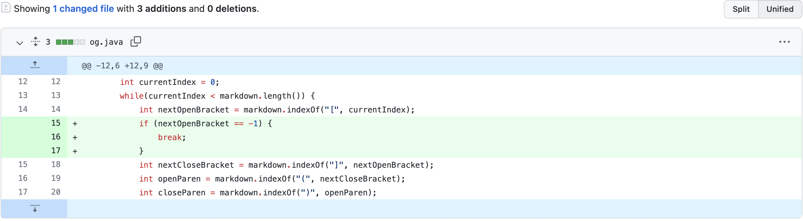
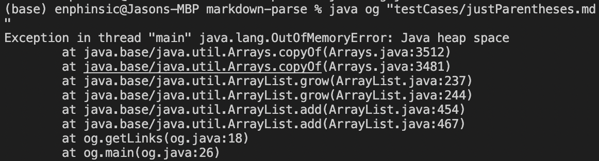
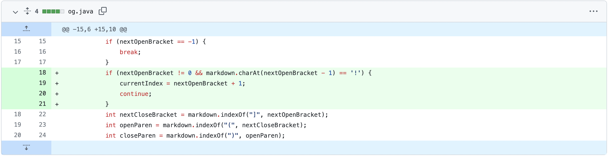
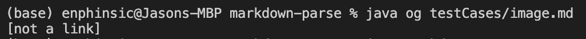
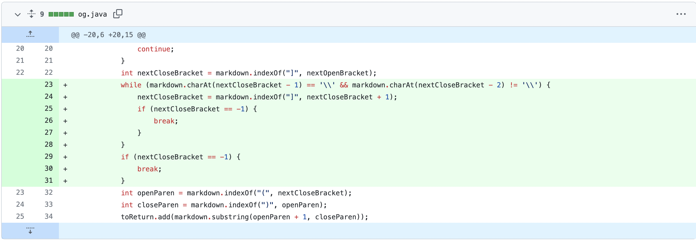
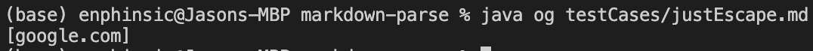

> # **1: Missing `[`**
---
1. ### **Fix:**
2. ### [**Test File:**](justParentheses.md) 
    There is no link as there is no `[` in the file, which is required to make links in markdown
3. ### **Error:**
4. ### **Relationship:**
    The **bug** itself is that the program does **not account** for **input** where **`[`** is **missing**, which can be seen in the given [*test file*](justParentheses.md). This then leads to the **symptom** being that there is an **`OutOfMemoryError`** as a result of the **infinite loop** procuded by the bug.

> # **2: Given an Image, Not a Link**
---
1. ### **Fix:**
2. ### [**Test File:**](image.md) 
    There is a `!` before the `[` indicating that the file contains an *image* **not** a *link* so the program should not parse it
3. ### **Error:**
4. ### **Relationship:**
    The **input** is that of an ***image* not a *link***, with the difference being that in front of the `[` there is an `!`, indicating it is an *image*. The **bug** stems from the issue that the program **does not account for `!`** in front of `[` and therefore **cannot distinguish an *image* from a *link***. This then results in the **symptom** of the program getting the contents of the *image*.

> # **3: Only Escape Character (`\`) in `[]`**
1. ### **Fix:**
2. ### [**Test File:**](justEscape.md) 
    There is an instance of `[\]` which should **not generate a link** in markdown as the escape character `\` should escape `]`, not making a full `[]` and therefore not making a link
3. ### **Error:**
4. ### **Relationship:**
    The **input** as mentioned above has `[\]` which in proper markdown syntax should *not* generate a link as the `]` is escaped. The **bug** is that the program does not account for `\` at all. Therefore, the **symptom** as seen, is when the program treates it like any other link and *does parse a link*, when it *shouldn't*.

---
