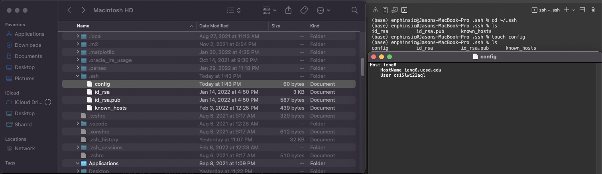
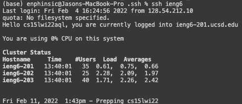
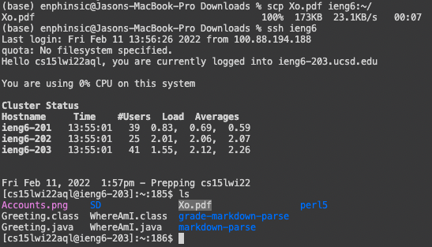

> # **Streamlining `ssh` Configuration**
---
1.  ### **Setup:** 
- In terminal navigate to `~/.ssh` and `ls` to see if you have the `config` file:
    - If you don't, enter `touch config` to create the `config` file
- Open the `config` file (this case, I accessed it through Finder)
- Paste the below into the file and save:
    
        Host ieng6
    
        HostName ieng6.ucsd.edu
    
        User (use your username)

2.  ### **Logging In:** 
- You now should be able to log in by just entering `ssh ieng6`

3. ### **scp:** 
- Now to `scp` files more easily, type:
    - `scp [filename] ieng6:~/`
    

