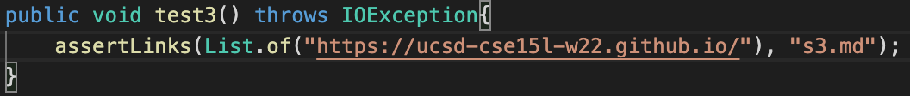
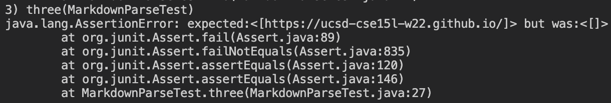

> # **Ours:**
https://github.com/ocboogie/markdown-parse
### **Snippet 1:**

### **Snippet 2:**

### **Snippet 3:**

---

> # **Reviewed:**
https://github.com/m1ma0314/markdown-parse
### **Snippet 1:**

### **Snippet 2:**

### **Snippet 3:**

---

> # **Fixes:**
### **Snippet 1:**
The program could look for pairs of backticks and check if the following elements are not characters that would need to be preceded by the escape character. This should be a somewhat simple/small change with a counter to check if the amount of backticks is even and a for-loop with an if-statement checking the following characters of the backtick.

### **Snippet 2:**
Could work by having the code check if the actual closing bracket if followed by an opening parenthesis. Additionally, it can keep track of the number of open and closed parenthesis//brackets to ensure that they are closed. Because this check seems "small" it should be able to be done in less than 10 lines.

### **Snippet 3:**
There could be a loop that iterates within parenthesis/brackets, stopping until there are no more newlines/empty spaces. The loop itself seems small/simple, but adding it with checking if it is in brackets/parenthesis may be more than 10 lines total.

---

