> # **Differences:**
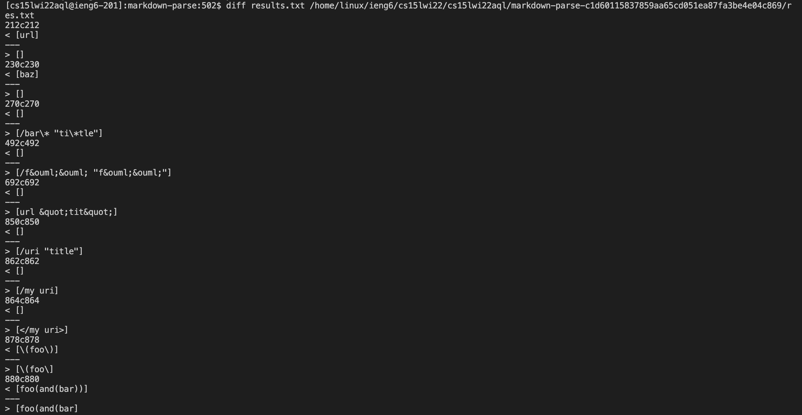
The results of testing the test files were saved to text files, where `diff` was run on them.

---
> # **Line 212 (test-files/194.md):**
### **Difference:**
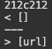
### **Professor's:**
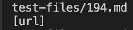
### **Group's:**
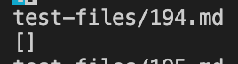

I would say that the professor's implementation is correct as despite there being a gap between the `]` and the `(`, markdown still seems to accept this as a valid input.

As a result, we should remove the check found in the `if` statement here:
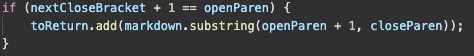 

---
> # **Line 878 (test-files/494.md):**
### **Difference:**
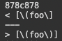
### **Professor's:**
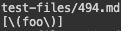
### **Group's:**
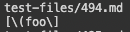
### **Correct:**
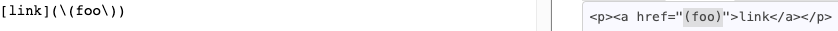

Although both seem to be wrong, I would say that the professor's implementation is slightly more accurate with his inclusion of: 

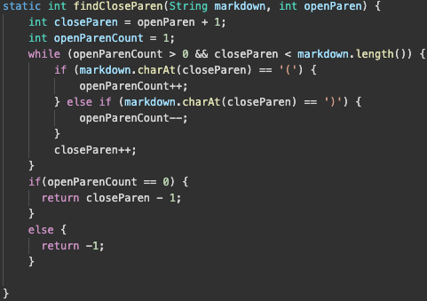

which allows for parentheses to found in the link. To help fix this, we should include code similiar to our groups's which checks for `\` right before `]`:

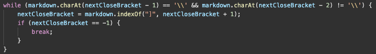

The similar code should check for `\` before `(` and `)` and should accordingly not included (or include) itself.
